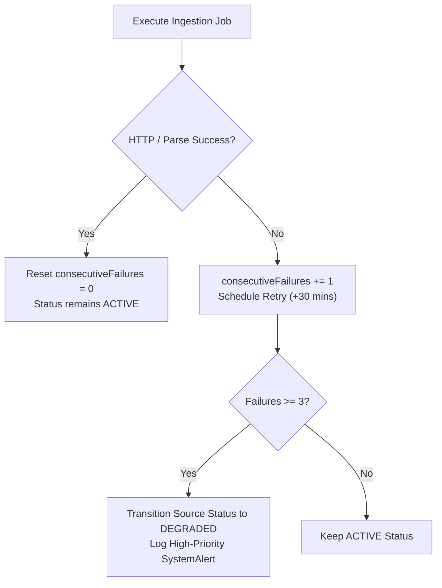

# CareerForgeX — Failure Recovery & Self-Healing Pipeline

This document explains how CareerForgeX handles unexpected server errors, source failures, API rate limits, and structural changes on external institutional websites.

---

## 1. Failure Isolation Guarantee

CareerForgeX is designed so that **a failure in one external source NEVER halts the ingestion pipeline for other sources**.
* Ingestion jobs are isolated per source (`IngestionJob` record with unique `runId`).
* If `Source A` (e.g. IIT Delhi) experiences an HTTP 504 Gateway Timeout, the error is recorded, consecutive failure counters are incremented, and processing immediately proceeds to `Source B`, `Source C`, and so on.

---

## 2. Source Degradation & Automatic Alerts

External websites frequently change page structures, undergo maintenance, or introduce transient network outages.



* **Threshold**: After **3 consecutive failed runs**, a source transitions from `ACTIVE` to `DEGRADED`.
* **SystemAlert**: A critical alert is written to the database (`SystemAlert` table), visible prominently on `/admin/automation`.
* **Retry Backoff**: Degraded sources are retried every 30 minutes with exponential backoff rather than every standard check frequency.

---

## 3. Self-Healing & Transient Errors

| Error Type | Pipeline Response | Resolution Mechanism |
|---|---|---|
| **HTTP 429 Too Many Requests** | Exponential backoff with randomized jitter | Respects `Retry-After` header if supplied; throttles requests to 1 request / 5 seconds per domain. |
| **HTTP 5xx Server Error** | Log error and schedule retry | Retried up to 3 times before recording job failure. |
| **Broken / Missing Application URL** | Marks opportunity status `PENDING_REVIEW` | Prevents students from encountering dead application links; routes to admin for manual check. |
| **Target Page Disappeared (HTTP 404)** | Increments `consecutive404s` counter | Transitions to `SOURCE_NOT_FOUND`. Only archived after 3 consecutive 404 checks across multiple days. |
| **Worker Process Crash** | Automatic supervisor restart | Managed via systemd or PM2; on startup, reads `last_worker_heartbeat` and resumes uncompleted jobs. |

---

## 4. Emergency Administrative Controls

If an external source begins malfunctioning, an administrator can execute immediate emergency controls via `/admin/automation` or direct API calls:

1. **Pause Ingestion Globally**:
   ```bash
   curl -X POST http://localhost:3000/api/admin/automation/control \
     -H "Content-Type: application/json" \
     -d '{"action": "PAUSE_ALL"}'
   ```
   Suspends all active scrapers immediately without stopping the web server or student-facing directory.

2. **Resume Ingestion**:
   ```bash
   curl -X POST http://localhost:3000/api/admin/automation/control \
     -H "Content-Type: application/json" \
     -d '{"action": "RESUME_ALL"}'
   ```

3. **Force Run Source Now**:
   ```bash
   curl -X POST http://localhost:3000/api/admin/automation/control \
     -H "Content-Type: application/json" \
     -d '{"action": "RUN_SOURCE_NOW", "sourceId": "<SOURCE_ID>"}'
   ```

4. **Mark Source Trusted / Block Source**:
   Allows instant quarantine of malicious or repeatedly failing candidate sources.
