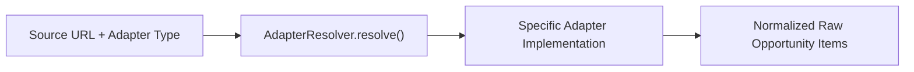

# CareerForgeX — Source Adapter Guide

CareerForgeX utilizes a modular, pluggable adapter architecture to ingest opportunities from diverse institutional systems without altering core business logic.

---

## 1. Adapter Architecture Overview



Each adapter inherits from `BaseSourceAdapter` (`src/lib/automation/adapters/base-adapter.ts`) and must implement:
```typescript
abstract parse(
  fetchResult: FetchResult,
  sourceContext: SourceContext
): Promise<RawExtractedItem[]>;
```

---

## 2. Supported Adapter Types

| Adapter Name | Key | Typical Targets | Example Use Cases |
|---|---|---|---|
| **HTMLAdapter** | `html` | Institutional noticeboards & circular tables | IIT Bombay, IIT Madras, IISc, IISER Bhopal |
| **RSSAdapter** | `rss` | RSS 2.0 XML feeds | Research lab blogs, universities with RSS feeds |
| **AtomAdapter** | `atom` | Atom 1.0 XML feeds | Modern academic feeds, WordPress announcements |
| **JSONAdapter** | `json` | REST endpoints & career page search APIs | Google Careers, Microsoft Research, Lever, Greenhouse |
| **APIAdapter** | `api` | Authenticated or custom career APIs | Specialized government job portals |
| **SitemapAdapter**| `sitemap`| XML Sitemaps (`sitemap.xml`) | Comprehensive university domain discovery |
| **PDFAdapter** | `pdf` | Downloadable circulars & advertisements | Government gazettes, institutional PDF notices |
| **PlaywrightAdapter**| `playwright`| Single-page client-side applications (SPA) | Portals requiring JavaScript hydration |

---

## 3. How to Implement a New Adapter

To add support for a new data format (for example, `GraphQLAdapter`):

1. Create `src/lib/automation/adapters/graphql-adapter.ts`:
```typescript
import { BaseSourceAdapter, FetchResult, SourceContext, RawExtractedItem } from "./base-adapter";

export class GraphQLAdapter extends BaseSourceAdapter {
  public readonly adapterType = "graphql";
  public readonly version = "1.0.0";

  public async parse(
    fetchResult: FetchResult,
    context: SourceContext
  ): Promise<RawExtractedItem[]> {
    const json = JSON.parse(fetchResult.content);
    const nodes = json.data?.opportunities || [];

    return nodes.map((node: any) => ({
      title: node.title,
      organization: node.orgName || context.name,
      url: node.applyUrl || context.url,
      rawText: `${node.title}\n${node.description}\nEligibility: ${node.eligibility}`,
      publishedDate: node.createdAt ? new Date(node.createdAt) : undefined,
    }));
  }
}
```

2. Register the adapter in `src/lib/automation/adapters/adapter-resolver.ts`:
```typescript
import { GraphQLAdapter } from "./graphql-adapter";

// Inside AdapterResolver.resolve():
case "graphql":
  return new GraphQLAdapter();
```

3. Configure any source in the database to use `adapterType: "graphql"`.

---

## 4. Adapter Best Practices

1. **Zero Hallucination**: Return only text extracted directly from the raw payload. Never guess missing deadlines or stipends.
2. **Robust Fallbacks**: If a specific CSS selector or JSON key is not present, fall back to parsing available surrounding text.
3. **URL Resolution**: Always resolve relative links (e.g. `/apply/123`) to absolute URLs using `new URL(relative, context.url).href`.
4. **Versioning**: Increment `adapterVersion` and `parserVersion` when modifying extraction selectors so that historical telemetry remains accurate.
