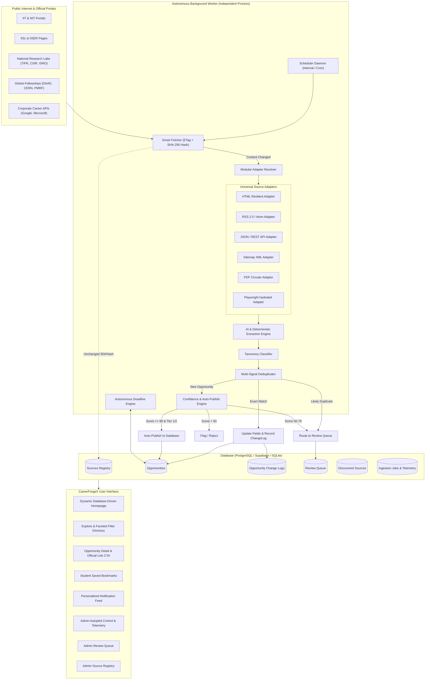

# CareerForgeX — System Architecture & Data Flow

CareerForgeX is an autonomous, self-updating student opportunity discovery and intelligence platform designed to eliminate daily manual updates. The system monitors official institutional portals, research institutes, government schemes, and corporate career pages, extracting structured opportunity details and maintaining an up-to-date registry of verified openings.

---

## 1. High-Level System Architecture

---

## 2. Component Breakdown

### A. Autonomous Scheduler & Worker (`src/worker/runner.ts`)
* Runs as an **isolated, standalone process** (`npm run worker` or `tsx src/worker/runner.ts`).
* **Zero Browser Dependency**: Does not require an administrator to open a browser tab or press "Run Now".
* Inspects due sources where `nextCheckAt <= now()`.
* Dispatches ingestion jobs in small, throttled batches.
* Records heartbeats every minute in `SystemMetric` (`last_worker_heartbeat`).
* Synchronizes deadlines and triggers active URL revalidation.

### B. Smart Fetcher & Change Detection (`src/lib/automation/fetcher.ts`)
* Performs conditional HTTP `GET` using `If-None-Match` (`ETag`) and `If-Modified-Since` (`Last-Modified`).
* Computes cryptographic `SHA-256` content hash.
* **Cost & Computation Optimization**: If the hash matches the previous fetch, the pipeline immediately skips expensive extraction and AI parsing.
* Polite crawling: Per-domain throttling (minimum 1 second between requests) and exponential backoff retry.
* Failure isolation: A crash or network timeout on one source never stops other sources.

### C. Universal Modular Adapters (`src/lib/automation/adapters/`)
* **HTMLAdapter**: Resilient semantic HTML parsing for Indian premier universities and circular tables.
* **RSSAdapter**: Parses RSS 2.0 newsfeeds and notices.
* **AtomAdapter**: Parses XML Atom feeds.
* **JSONAdapter**: Handles REST JSON endpoints with customizable path selectors.
* **APIAdapter**: Handles structured career portal APIs.
* **SitemapAdapter**: Discovers newly published opportunity URLs from institutional XML sitemaps.
* **PDFAdapter**: Extracts text and application dates from official PDF circulars.
* **PlaywrightAdapter**: Fallback for client-side JavaScript hydrated applications.

### D. AI & Deterministic Extraction Engine (`src/lib/automation/extractor.ts`)
* Strictly extracts validated fields: Title, Host Organization, Opportunity Type, Short Summary, Full Description, Eligibility, Degree Requirements, Academic Year, Branch Requirements, Domain, Skills, Mode, Duration, Stipend, Application Deadline, and Official URL.
* **Zero-Hallucination Policy**: If information is absent in the source text, it is set to `null`. Stipends, deadlines, and dates are never fabricated.
* Operates in dual-mode:
  * **AI Provider Mode**: Uses OpenAI, Google Gemini, or Anthropic when API keys are configured.
  * **Deterministic Offline Mode**: High-precision regex pattern matcher and NER rules that run with zero cost in test, dev, and airgapped environments.

### E. Multi-Signal Deduplication (`src/lib/automation/deduplicator.ts`)
Evaluates multiple signals to prevent duplicate listings across updates, re-posts, and aggregator links:
1. Exact Canonical / Source / Application URL match.
2. Jaccard word-token similarity on normalized titles ($\ge 0.85$) + same host organization $\rightarrow$ `EXACT_MATCH`.
3. Same application deadline + title similarity $\ge 0.65 \rightarrow$ `LIKELY_DUPLICATE`.
4. Title similarity $\ge 0.70 \rightarrow$ `LIKELY_DUPLICATE`.

### F. Automatic Updates & Change Logs (`src/lib/automation/updater.ts`)
* When an existing opportunity is updated at the source (e.g. deadline extended, stipend increased, eligibility clarified), the existing record is updated in place.
* Bumps `version` and records an audit record in `OpportunityChangeLog` with:
  * `fieldName`
  * `oldValue`
  * `newValue`
  * `changedAt`
  * `source`
  * `actorType: 'SYSTEM'`

### G. Automatic Deadline Engine (`src/lib/automation/deadline-engine.ts`)
* Computes real-time dynamic countdown:
  * `daysRemaining > 3` $\rightarrow$ `OPEN`
  * `0 <= daysRemaining <= 3` $\rightarrow$ `CLOSING_SOON`
  * `daysRemaining < 0` $\rightarrow$ `EXPIRED`
  * No deadline $\rightarrow$ `NO_DEADLINE`
* Auto-archives records expired for more than 30 days.

### H. Confidence & Auto-Publishing (`src/lib/automation/publisher.ts`)
* Computes confidence score ($0 - 100$):
  * Official Source Tier 1: $+30$
  * Valid Application URL: $+20$
  * Organization Named: $+15$
  * Definite Deadline: $+15$
  * Detailed Eligibility: $+10$
  * Clean Schema: $+10$
* **Publishing Rules**:
  * Score $\ge 80$ + Tier 1/2 $\rightarrow$ Auto-Publish (`PUBLISHED`)
  * Score $50 - 79$ or Duplicate Flag $\rightarrow$ Admin Review Queue (`PENDING_REVIEW`)
  * Score $< 50$ $\rightarrow$ Rejected (`REJECTED`)
