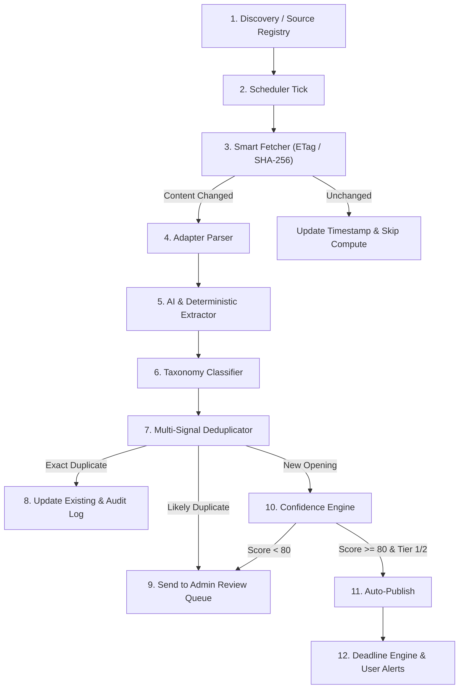

# CareerForgeX — Automation Engine Specification

This document details the mechanics of the autonomous opportunity discovery, ingestion, validation, and publishing pipeline.

---

## 1. Pipeline Stages

---

## 2. Smart Fetching & Change Detection

To prevent wasteful repeated computation and eliminate unnecessary AI API calls:
* Every source stores `etag`, `lastModified`, and `contentHash` (SHA-256) in the `sources` table.
* On fetch, HTTP requests include `If-None-Match` and `If-Modified-Since` headers.
* If the server returns HTTP 304 (Not Modified), or if the computed body hash matches the stored `contentHash`, the job updates `lastCheckedAt` and exits early without running AI or database modifications.

---

## 3. Strict Zero-Hallucination AI Extraction

When content has changed, `OpportunityExtractor` parses the unstructured text:
* Extracts 18 structured attributes adhering to strict schemas.
* **Never guesses or infers missing data**:
  * If a stipend is not mentioned, it is stored as `null` or marked `"Stipend as per institute norms"`.
  * If a deadline is not found, `deadline` is `null` and `deadlineStatus` is `"NO_DEADLINE"`.
  * Application links must be valid HTTP/HTTPS URLs present in the document.

---

## 4. Multi-Signal Deduplication

Opportunities from multiple announcements, circular revisions, or aggregator cross-posts are evaluated against existing entries:

1. **Exact Canonical / Application URL Match**:
   * If `applicationUrl` matches an active opportunity, it is categorized as `EXACT_MATCH`.
2. **Title & Organization Similarity**:
   * Tokenized Jaccard similarity $\ge 0.85$ with identical organization $\rightarrow$ `EXACT_MATCH`.
3. **Deadline Match with High Text Similarity**:
   * Same application deadline and title similarity $\ge 0.65 \rightarrow$ `LIKELY_DUPLICATE`.
4. **Fuzzy Title Match**:
   * Similarity $\ge 0.70 \rightarrow$ `LIKELY_DUPLICATE` (routes to admin review).

---

## 5. Automatic In-Place Updates

When an exact match is discovered:
* CareerForgeX does **not** create duplicate records like `"IIT Bombay Internship - 2027 (Update)"`.
* It updates the existing record in-place (`updatedAt`, `deadline`, `stipend`, `eligibility`, `applicationUrl`).
* Generates an immutable entry in `OpportunityChangeLog` capturing the previous value, new value, timestamp, and actor (`SYSTEM`).

---

## 6. Deadline Lifecycle Engine

Every minute, the worker executes `DeadlineEngine.syncAllDeadlines()`:
* **OPEN**: Deadline $> 3$ days remaining.
* **CLOSING_SOON**: Deadline $\le 3$ days remaining and $\ge 0$.
* **EXPIRED**: Deadline $< 0$ (past).
* **NO_DEADLINE**: Open rolling applications without an explicit expiration date.
* **Retention Policy**: Expired records older than 30 days are automatically archived (`status = 'ARCHIVED'`).
