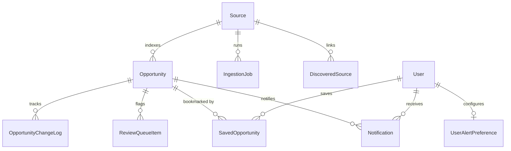

# CareerForgeX — Database Schema & Data Models

CareerForgeX uses Prisma ORM with support for SQLite (local zero-config development) and PostgreSQL / Supabase (production).

---

## 1. Entity-Relationship Diagram

---

## 2. Core Tables

### A. `sources`
Stores monitored official portals, adapter configurations, check intervals, and health counters.

| Column | Type | Description |
|---|---|---|
| `id` | String (CUID) | Primary key. |
| `name` | String | Institutional portal name. |
| `slug` | String (Unique) | URL-friendly identifier. |
| `url` | String | Target portal URL. |
| `sourceType` | String | `iit`, `nit`, `iisc`, `iiser`, `university`, `corporate`, `scholarship`. |
| `tier` | Int | `1` (Premier/Official), `2` (Recognized), `3` (Secondary). |
| `adapterType` | String | `html`, `rss`, `atom`, `json`, `api`, `sitemap`, `pdf`, `playwright`. |
| `checkFrequency` | Int | Frequency in minutes between checks. |
| `priority` | Int | `1` (High), `2` (Normal), `3` (Low). |
| `status` | String | `ACTIVE`, `PAUSED`, `DEGRADED`, `BLOCKED`, `REVIEW`. |
| `trustStatus` | String | `TRUSTED`, `VERIFIED`, `PROBATION`, `UNTRUSTED`. |
| `lastCheckedAt` | DateTime? | Timestamp of last fetch attempt. |
| `nextCheckAt` | DateTime? | Calculated timestamp for next scheduled run. |
| `consecutiveFailures` | Int | Incremented on errors; triggers `DEGRADED` at 3. |
| `etag` / `lastModified` | String? | Conditional HTTP caching headers. |
| `contentHash` | String? | SHA-256 hash of previous response payload. |

---

### B. `opportunities`
Stores structured, verified opportunity listings displayed to students.

| Column | Type | Description |
|---|---|---|
| `id` | String (CUID) | Primary key. |
| `title` | String | Opportunity title. |
| `slug` | String (Unique) | Canonical route slug. |
| `organization` | String | Host institute or employer. |
| `opportunityType` | String | `Research`, `Internship`, `Fellowship`, `PhD`, `Scholarship`, `Job`, etc. |
| `shortSummary` | String | 1-2 sentence overview for cards. |
| `fullDescription`| String | Complete verified text. |
| `eligibility` | String? | Degree, CGPA, and prerequisite requirements. |
| `degreeRequirements`| String? (JSON) | Array of eligible degrees (e.g. `["B.Tech", "M.Sc"]`). |
| `yearRequirements`| String? (JSON) | Array of eligible years (e.g. `["3rd Year"]`). |
| `domain` | String | Normalized taxonomy domain (e.g. `Computer Science / AI`). |
| `mode` | String | `On-site`, `Remote`, or `Hybrid`. |
| `stipend` | String? | Extracted stipend text (e.g. `₹15,000 / month`). |
| `isPaid` | Boolean | True if stipend or salary is provided. |
| `deadline` | DateTime? | Application closing timestamp. |
| `deadlineStatus` | String | `OPEN`, `CLOSING_SOON`, `EXPIRED`, `NO_DEADLINE`. |
| `daysRemaining` | Int? | Dynamic days remaining until deadline. |
| `applicationUrl` | String | Direct official application portal link. |
| `sourceUrl` | String | Original source notification URL. |
| `confidenceScore` | Int | Computed metric between 0 and 100. |
| `status` | String | `PUBLISHED`, `PENDING_REVIEW`, `ARCHIVED`, `REJECTED`. |
| `isVerified` | Boolean | True for Tier 1 and Tier 2 sources. |
| `version` | Int | Incremented on automatic updates. |

---

### C. `opportunity_change_logs`
Immutable audit trail tracking every automatic and administrative change.

| Column | Type | Description |
|---|---|---|
| `id` | String | Primary key. |
| `opportunityId` | String | Foreign key to `opportunities.id`. |
| `fieldName` | String | Updated field (e.g. `deadline`, `stipend`, `status`). |
| `oldValue` | String? | Pre-update value. |
| `newValue` | String? | New value applied by pipeline. |
| `reason` | String? | Explanation from extractor / updater. |
| `actorType` | String | `SYSTEM` (autonomous) or `ADMIN` (manual edit). |
| `changedAt` | DateTime | Timestamp of update. |

---

### D. `review_queue_items`
Holds opportunities requiring human review (low confidence score or likely duplicates).

| Column | Type | Description |
|---|---|---|
| `id` | String | Primary key. |
| `opportunityId` | String? | Linked opportunity candidate. |
| `rawPayload` | String? | Raw HTML / JSON snippet. |
| `extractedData` | String? | Proposed extracted fields. |
| `reviewReason` | String | `LOW_CONFIDENCE`, `LIKELY_DUPLICATE`, `MANUAL_FLAG`. |
| `status` | String | `PENDING`, `APPROVED`, `MERGED`, `REJECTED`. |

---

### E. `discovered_sources`
Registry of prospective institutional portals discovered autonomously via sitemaps or link extraction.

---

### F. `ingestion_jobs`
Job execution logs detailing runtime duration, items scanned, items created, and errors.
