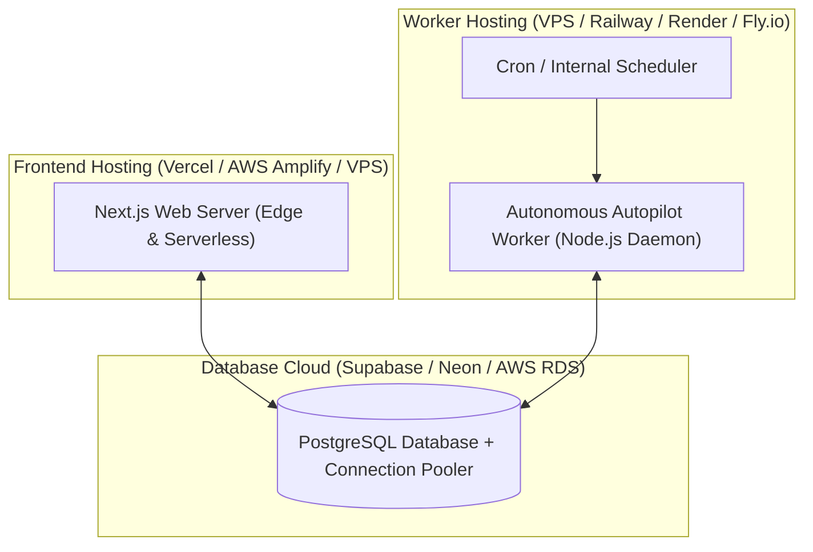

# CareerForgeX — Production Deployment Guide

This guide details how to deploy the CareerForgeX Web Interface, Database, and Autonomous Background Worker into production.

---

## 1. Production Architecture Separation

In production, the architecture separates the public Next.js frontend from the continuous background worker daemon:



> **IMPORTANT**: The background worker daemon must run independently of any user browser or laptop. Closing your laptop or browser must NOT stop automated opportunity updates.

---

## 2. Environment Variables Checklist

Ensure these variables are configured in your production hosting dashboards:

| Variable | Description | Required | Where to Configure |
|---|---|---|---|
| `DATABASE_URL` | PostgreSQL connection pooler URI (`?sslmode=require`) | Yes | Frontend & Worker |
| `DIRECT_URL` | Direct PostgreSQL URI for Prisma migrations | Yes | Frontend & Worker |
| `AUTH_SECRET` | 32+ byte cryptographic random secret (`openssl rand -base64 32`) | Yes | Frontend & Worker |
| `NEXT_PUBLIC_APP_URL` | Canonical public URL (e.g. `https://careerforgex.com`) | Yes | Frontend |
| `CRON_SECRET` | Secret token for external cron HTTP triggers | Yes | Frontend & Worker |
| `WORKER_SECRET` | Secret key for worker orchestration | Yes | Worker |
| `WORKER_INTERVAL_MS`| Polling interval in ms (default: `60000`) | No | Worker |
| `ENABLE_LIVE_AI_EXTRACTION` | Set to `"true"` to enable OpenAI/Gemini/Anthropic LLMs | No | Worker |
| `AI_PROVIDER` | `openai`, `gemini`, or `anthropic` | No | Worker |
| `AI_PROVIDER_KEY` | Provider API key | No | Worker |

---

## 3. Database Deployment (Supabase / PostgreSQL)

1. Create a new PostgreSQL database on [Supabase](https://supabase.com).
2. Copy the Connection Pooling URL (Transaction mode, port 6543) into `DATABASE_URL`.
3. Copy the Direct URL (Session mode, port 5432) into `DIRECT_URL`.
4. Apply the Prisma migrations:
   ```bash
   npx prisma db push --schema=./prisma/schema.postgres.prisma
   ```
5. Seed initial official premier sources:
   ```bash
   node scripts/seed.mjs
   ```

---

## 4. Deploying the Frontend (Vercel)

1. Connect the GitHub repository to Vercel.
2. Set Build Command: `npm run build`
3. Set Output Directory: `.next`
4. Configure environment variables (`DATABASE_URL`, `AUTH_SECRET`, `NEXT_PUBLIC_APP_URL`).
5. Deploy.

---

## 5. Deploying the Autonomous Worker (Docker / VPS / Railway)

### Using Docker
Create `Dockerfile.worker`:
```dockerfile
FROM node:20-alpine
WORKDIR /app
COPY package*.json ./
RUN npm ci --only=production
COPY prisma ./prisma/
RUN npx prisma generate
COPY src ./src/
COPY tsconfig.json ./
ENV NODE_ENV=production
CMD ["npm", "run", "worker"]
```

Build and run:
```bash
docker build -f Dockerfile.worker -t careerforgex-worker .
docker run -d --restart always --env-file .env careerforgex-worker
```

### Using PM2 on a Linux VPS
```bash
npm ci --production
npx prisma generate
pm2 start "npm run worker" --name "cfx-worker"
pm2 save
pm2 startup
```
